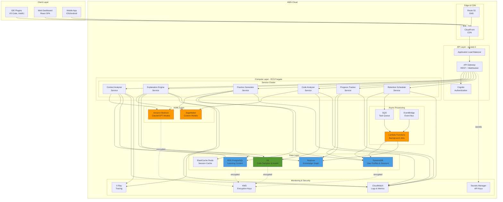

# Design Document: AI Learning Assistant

## Overview

The AI Learning Assistant is a sophisticated learning platform that combines artificial intelligence, educational psychology principles, and developer workflow integration to create an adaptive, personalized learning experience. The system uses a multi-component architecture where each component specializes in a specific aspect of the learning process: understanding user context, generating personalized content, tracking progress, and optimizing retention.

The core innovation lies in the tight integration between the user's active development work and the learning process. Rather than treating learning as a separate activity, the system embeds educational opportunities directly into the development workflow, analyzing code in real-time and providing contextual guidance that helps users learn while they build.

The system maintains a dynamic Knowledge Graph for each user, tracking mastery levels across hundreds of technical concepts. This graph informs all system decisions, from content difficulty to exercise generation to review scheduling. Combined with spaced repetition algorithms and adaptive difficulty adjustment, the system optimizes for long-term retention rather than short-term completion.

## Architecture

The system follows a modular, event-driven architecture with clear separation between data collection, analysis, content generation, and delivery layers.

### High-Level Architecture

```
┌─────────────────────────────────────────────────────────────┐
│                     User Interface Layer                     │
│  (IDE Plugins, Web Dashboard, Mobile App, CLI)              │
└────────────────┬────────────────────────────────────────────┘
                 │
┌────────────────┴────────────────────────────────────────────┐
│                    API Gateway & Router                      │
│         (Authentication, Rate Limiting, Routing)             │
└────────────────┬────────────────────────────────────────────┘
                 │
┌────────────────┴────────────────────────────────────────────┐
│                   Core Service Layer                         │
│  ┌──────────────┐  ┌──────────────┐  ┌──────────────┐     │
│  │   Context    │  │ Explanation  │  │   Practice   │     │
│  │   Analyzer   │  │    Engine    │  │  Generator   │     │
│  └──────────────┘  └──────────────┘  └──────────────┘     │
│  ┌──────────────┐  ┌──────────────┐  ┌──────────────┐     │
│  │    Code      │  │   Progress   │  │  Retention   │     │
│  │   Analyzer   │  │   Tracker    │  │  Scheduler   │     │
│  └──────────────┘  └──────────────┘  └──────────────┘     │
└────────────────┬────────────────────────────────────────────┘
                 │
┌────────────────┴────────────────────────────────────────────┐
│                    Data Layer                                │
│  ┌──────────────┐  ┌──────────────┐  ┌──────────────┐     │
│  │  Knowledge   │  │   Learning   │  │     User     │     │
│  │    Graph     │  │   Content    │  │   Profiles   │     │
│  │     DB       │  │     DB       │  │      DB      │     │
│  └──────────────┘  └──────────────┘  └──────────────┘     │
└─────────────────────────────────────────────────────────────┘
```

### AWS Deployment Architecture



### AWS Service Rationale

**API Gateway**: Handles REST and WebSocket connections for real-time IDE integration, provides built-in authentication integration with Cognito, and offers request throttling and rate limiting.

**ECS Fargate**: Runs containerized microservices without managing servers, provides auto-scaling based on load, and enables independent deployment and scaling of each service.

**Amazon Bedrock**: Provides access to foundation models (Claude, GPT) for explanation generation and question answering without managing ML infrastructure.

**SageMaker**: Hosts custom-trained models for code analysis and exercise generation that require domain-specific fine-tuning.

**Neptune**: Graph database optimized for the Knowledge Graph with complex relationship queries, supports efficient prerequisite traversal and concept relationship analysis.

**DynamoDB**: High-performance NoSQL for user profiles, session data, and progress tracking with single-digit millisecond latency and automatic scaling.

**RDS PostgreSQL**: Relational database for structured learning content, exercises, and explanations with ACID guarantees and complex query support.

**ElastiCache Redis**: In-memory cache for active contexts and frequently accessed data, reduces database load and improves response times.

**S3**: Object storage for code samples, user-uploaded code, and static assets with versioning and lifecycle policies.

**SQS + Lambda**: Asynchronous processing for background tasks like review scheduling, analytics aggregation, and batch operations.

**EventBridge**: Event-driven architecture for decoupling services, triggers workflows based on user actions and system events.

**CloudWatch + X-Ray**: Comprehensive monitoring, logging, and distributed tracing for debugging and performance optimization.

**KMS**: Centralized encryption key management for data at rest across all storage services.

### Scalability Considerations

**Horizontal Scaling**: All services run in ECS Fargate with auto-scaling policies based on CPU, memory, and custom metrics (requests per second, queue depth).

**Database Scaling**: 
- Neptune: Read replicas for query distribution
- DynamoDB: On-demand capacity mode for automatic scaling
- RDS: Read replicas and connection pooling
- ElastiCache: Cluster mode for distributed caching

**Cost Optimization**:
- Use Fargate Spot for non-critical background processing
- Implement S3 lifecycle policies to move old data to Glacier
- Cache AI model responses to reduce Bedrock API calls
- Use DynamoDB on-demand for variable workloads

**Geographic Distribution**: Deploy in multiple regions (us-east-1, eu-west-1, ap-southeast-1) with Route 53 latency-based routing for global users.

### Component Responsibilities

**Context Analyzer**: Monitors user's development environment, analyzes open files, recent changes, and active projects to build a real-time understanding of what the user is working on.

**Explanation Engine**: Generates multi-level explanations of code and concepts, adapting complexity and style based on user's mastery level and learning preferences.

**Practice Generator**: Creates exercises, coding challenges, and interactive problems tailored to user's skill level and learning goals.

**Code Analyzer**: Performs static analysis on user code to identify learning opportunities, suggest improvements, and detect patterns worth discussing.

**Progress Tracker**: Maintains historical records of user progress, calculates mastery levels, and generates analytics and visualizations.

**Retention Scheduler**: Implements spaced repetition algorithms to schedule review sessions and optimize long-term knowledge retention.

**Knowledge Graph DB**: Graph database storing concepts, their relationships, and user mastery levels for each concept.

**Learning Content DB**: Repository of explanations, examples, exercises, and learning materials indexed by concept and difficulty.

**User Profiles DB**: Stores user preferences, learning history, session data, and privacy settings.

## Components and Interfaces

### Context Analyzer

**Purpose**: Build and maintain understanding of user's current work context.

**Key Operations**:
- `analyzeActiveContext(userId: string, files: File[]): Context`
- `detectContextSwitch(previousContext: Context, currentContext: Context): boolean`
- `extractRelevantConcepts(context: Context): Concept[]`
- `updateContextContinuously(userId: string): void`

**Data Structures**:
```typescript
interface Context {
  userId: string;
  timestamp: number;
  activeFiles: FileInfo[];
  recentChanges: CodeChange[];
  detectedLanguages: string[];
  detectedFrameworks: string[];
  relevantConcepts: string[];
  projectType: string;
}

interface FileInfo {
  path: string;
  language: string;
  size: number;
  lastModified: number;
}

interface CodeChange {
  file: string;
  linesAdded: number;
  linesRemoved: number;
  timestamp: number;
}
```

### Knowledge Graph

**Purpose**: Represent user's technical knowledge and track mastery levels.

**Key Operations**:
- `getMasteryLevel(userId: string, conceptId: string): number`
- `updateMastery(userId: string, conceptId: string, newLevel: number): void`
- `findPrerequisites(conceptId: string): Concept[]`
- `findRelatedConcepts(conceptId: string, maxDistance: number): Concept[]`
- `identifyGaps(userId: string, targetConcept: string): Concept[]`

**Data Structures**:
```typescript
interface Concept {
  id: string;
  name: string;
  description: string;
  category: string;
  prerequisites: string[];
  relatedConcepts: string[];
  difficultyLevel: number;
}

interface UserMastery {
  userId: string;
  conceptId: string;
  masteryLevel: number; // 0-100
  lastAssessed: number;
  assessmentHistory: Assessment[];
}

interface Assessment {
  timestamp: number;
  score: number;
  assessmentType: 'exercise' | 'review' | 'application';
}
```

### Learning Path Generator

**Purpose**: Create personalized sequences of learning objectives.

**Key Operations**:
- `generatePath(userId: string, goal: LearningGoal): LearningPath`
- `adaptPath(pathId: string, userProgress: Progress): LearningPath`
- `identifyNextObjective(pathId: string): LearningObjective`
- `insertRemedialContent(pathId: string, conceptId: string): void`

**Data Structures**:
```typescript
interface LearningGoal {
  targetConcept: string;
  timeframe: number; // days
  priority: 'high' | 'medium' | 'low';
}

interface LearningPath {
  id: string;
  userId: string;
  goal: LearningGoal;
  objectives: LearningObjective[];
  currentIndex: number;
  createdAt: number;
  lastUpdated: number;
}

interface LearningObjective {
  conceptId: string;
  estimatedDuration: number; // minutes
  prerequisites: string[];
  completed: boolean;
  masteryThreshold: number;
}
```

### Explanation Engine

**Purpose**: Generate adaptive, multi-level explanations of technical concepts.

**Key Operations**:
- `explainCode(code: string, context: Context, userMastery: UserMastery[]): Explanation`
- `explainConcept(conceptId: string, userMasteryLevel: number): Explanation`
- `generateAlternativeExplanation(originalExplanation: Explanation, feedback: string): Explanation`
- `adjustComplexity(explanation: Explanation, targetLevel: number): Explanation`

**Data Structures**:
```typescript
interface Explanation {
  id: string;
  conceptId: string;
  levels: ExplanationLevel[];
  examples: CodeExample[];
  visualizations: Visualization[];
  relatedConcepts: string[];
}

interface ExplanationLevel {
  level: 'overview' | 'detailed' | 'line-by-line';
  content: string;
  complexity: number;
}

interface CodeExample {
  code: string;
  language: string;
  explanation: string;
  highlightedLines: number[];
}

interface Visualization {
  type: 'diagram' | 'flowchart' | 'data-structure';
  format: 'mermaid' | 'svg' | 'ascii';
  content: string;
}
```

### Practice Generator

**Purpose**: Create adaptive exercises and coding challenges.

**Key Operations**:
- `generateExercise(conceptId: string, difficulty: number, context?: Context): Exercise`
- `adjustDifficulty(exerciseId: string, userPerformance: Performance): Exercise`
- `generateHint(exerciseId: string, attemptCount: number): Hint`
- `evaluateSolution(exerciseId: string, solution: string): Evaluation`

**Data Structures**:
```typescript
interface Exercise {
  id: string;
  conceptId: string;
  difficulty: number;
  prompt: string;
  starterCode?: string;
  testCases: TestCase[];
  hints: Hint[];
  timeEstimate: number;
}

interface TestCase {
  input: any;
  expectedOutput: any;
  isHidden: boolean;
}

interface Hint {
  level: number;
  content: string;
  revealedAt?: number;
}

interface Evaluation {
  passed: boolean;
  testResults: TestResult[];
  feedback: string;
  alternativeApproaches: string[];
  masteryImpact: number;
}

interface TestResult {
  testCase: TestCase;
  actualOutput: any;
  passed: boolean;
  executionTime: number;
}
```

### Retention Scheduler

**Purpose**: Implement spaced repetition for long-term knowledge retention.

**Key Operations**:
- `scheduleReview(userId: string, conceptId: string): ReviewSession`
- `getUpcomingReviews(userId: string): ReviewSession[]`
- `recordReviewOutcome(sessionId: string, outcome: ReviewOutcome): void`
- `adjustInterval(userId: string, conceptId: string, performance: number): void`

**Data Structures**:
```typescript
interface ReviewSession {
  id: string;
  userId: string;
  conceptId: string;
  scheduledFor: number;
  interval: number; // days
  repetitionNumber: number;
  completed: boolean;
}

interface ReviewOutcome {
  sessionId: string;
  recallSuccess: boolean;
  responseTime: number;
  confidence: number; // 1-5
  timestamp: number;
}

interface SpacedRepetitionParams {
  easeFactor: number;
  interval: number;
  repetitions: number;
}
```

### Code Analyzer

**Purpose**: Analyze user code for learning opportunities and improvements.

**Key Operations**:
- `analyzeCode(code: string, language: string): Analysis`
- `identifyPatterns(code: string): Pattern[]`
- `detectAntiPatterns(code: string): AntiPattern[]`
- `suggestImprovements(code: string, userMastery: UserMastery[]): Suggestion[]`

**Data Structures**:
```typescript
interface Analysis {
  code: string;
  language: string;
  patterns: Pattern[];
  antiPatterns: AntiPattern[];
  suggestions: Suggestion[];
  complexity: ComplexityMetrics;
}

interface Pattern {
  name: string;
  location: CodeLocation;
  description: string;
  relatedConcepts: string[];
}

interface AntiPattern {
  name: string;
  location: CodeLocation;
  severity: 'low' | 'medium' | 'high';
  explanation: string;
  alternatives: string[];
}

interface Suggestion {
  type: 'optimization' | 'best-practice' | 'learning-opportunity';
  priority: number;
  description: string;
  example: string;
  relatedConcepts: string[];
}

interface CodeLocation {
  startLine: number;
  endLine: number;
  startColumn: number;
  endColumn: number;
}

interface ComplexityMetrics {
  cyclomaticComplexity: number;
  cognitiveComplexity: number;
  linesOfCode: number;
  maintainabilityIndex: number;
}
```

### Progress Tracker

**Purpose**: Monitor and record learning progress over time.

**Key Operations**:
- `recordProgress(userId: string, event: ProgressEvent): void`
- `calculateMasteryChange(userId: string, conceptId: string, timeRange: TimeRange): number`
- `getLearningVelocity(userId: string, timeRange: TimeRange): number`
- `generateProgressReport(userId: string): ProgressReport`

**Data Structures**:
```typescript
interface ProgressEvent {
  userId: string;
  type: 'exercise-completed' | 'concept-learned' | 'review-completed' | 'milestone-achieved';
  conceptId: string;
  timestamp: number;
  metadata: Record<string, any>;
}

interface TimeRange {
  start: number;
  end: number;
}

interface ProgressReport {
  userId: string;
  timeRange: TimeRange;
  conceptsMastered: number;
  learningVelocity: number;
  masteryChanges: MasteryChange[];
  milestones: Milestone[];
  recommendations: string[];
}

interface MasteryChange {
  conceptId: string;
  previousLevel: number;
  currentLevel: number;
  change: number;
}

interface Milestone {
  id: string;
  name: string;
  achievedAt: number;
  description: string;
}
```

## Data Models

### User Profile

```typescript
interface UserProfile {
  id: string;
  email: string;
  createdAt: number;
  preferences: UserPreferences;
  learningGoals: LearningGoal[];
  activePaths: string[];
  privacySettings: PrivacySettings;
}

interface UserPreferences {
  preferredFormats: ('text' | 'visual' | 'interactive')[];
  notificationSettings: NotificationSettings;
  difficultyPreference: 'adaptive' | 'challenging' | 'comfortable';
  sessionDuration: number; // preferred minutes
}

interface NotificationSettings {
  reviewReminders: boolean;
  milestoneAlerts: boolean;
  dailyDigest: boolean;
}

interface PrivacySettings {
  dataCollectionOptIn: boolean;
  shareProgressWithPeers: boolean;
  anonymousAnalytics: boolean;
}
```

### Learning Session

```typescript
interface LearningSession {
  id: string;
  userId: string;
  startTime: number;
  endTime?: number;
  goal?: string;
  timeLimit?: number;
  activities: SessionActivity[];
  context: Context;
  outcomes: SessionOutcome;
}

interface SessionActivity {
  type: 'explanation' | 'exercise' | 'review' | 'question' | 'code-analysis';
  timestamp: number;
  conceptId: string;
  duration: number;
  successful: boolean;
}

interface SessionOutcome {
  conceptsCovered: string[];
  exercisesCompleted: number;
  masteryGains: MasteryChange[];
  goalAchieved: boolean;
}
```

## Correctness Properties

*A property is a characteristic or behavior that should hold true across all valid executions of a system—essentially, a formal statement about what the system should do. Properties serve as the bridge between human-readable specifications and machine-verifiable correctness guarantees.*


### Learning Path Properties

**Property 1: Learning Path Generation Completeness**
*For any* learning goal and user knowledge graph, generating a learning path should produce a structured path with ordered objectives that address all prerequisite gaps between the user's current knowledge and the target concept.
**Validates: Requirements 1.1, 1.2**

**Property 2: Learning Path Progress Updates**
*For any* learning path and completed objective, marking the objective as complete should update the path's current index and reflect the completion in the path state.
**Validates: Requirements 1.3**

**Property 3: Adaptive Path Modification**
*For any* learning path and user performance data, when mastery levels change, the system should adapt the path by reordering, adding, or removing objectives based on demonstrated proficiency.
**Validates: Requirements 1.4**

**Property 4: Remedial Content Insertion**
*For any* learning path where a prerequisite concept has mastery level below 60, the path should include remedial content for that concept before dependent objectives.
**Validates: Requirements 1.5**

### Context Awareness Properties

**Property 5: Context Analysis Completeness**
*For any* user assistance request, the system should analyze both the active context (files, recent changes) and the user's knowledge graph before generating responses.
**Validates: Requirements 2.1, 12.1**

**Property 6: Context-Referenced Explanations**
*For any* explanation generated with an active context, the explanation should reference or incorporate patterns from the user's current code when relevant to the concept being explained.
**Validates: Requirements 2.2**

**Property 7: Unfamiliar Technology Detection**
*For any* active context containing libraries or frameworks not in the user's knowledge graph, the system should identify them as unfamiliar and offer relevant learning resources.
**Validates: Requirements 2.3**

**Property 8: Session Context Continuity**
*For any* learning session, context information from earlier in the session should remain accessible and influence responses throughout the entire session duration.
**Validates: Requirements 2.4**

**Property 9: Session Pause-Resume Round Trip**
*For any* learning session, pausing and then resuming the session should preserve all context, progress, and state information.
**Validates: Requirements 11.5**

### Explanation Properties

**Property 10: Three-Level Explanation Structure**
*For any* code or concept explanation, the generated explanation should contain exactly three levels: overview, detailed walkthrough, and line-by-line analysis.
**Validates: Requirements 3.1, 3.2**

**Property 11: Pattern Identification in Explanations**
*For any* code explanation, the system should identify and highlight at least one pattern, idiom, or best practice present in the code.
**Validates: Requirements 3.3**

**Property 12: Alternative Explanation Generation**
*For any* explanation and confusion signal, the system should generate an alternative explanation that differs in approach, analogies, or examples from the original.
**Validates: Requirements 3.4**

**Property 13: Mastery-Matched Explanation Complexity**
*For any* concept explanation and user mastery level, the explanation complexity should correlate with the mastery level (higher mastery → more advanced terminology and depth).
**Validates: Requirements 3.5, 12.2**

### Exercise and Practice Properties

**Property 14: Exercise Generation from Concepts**
*For any* completed learning module, the system should generate at least one exercise that targets the concepts covered in that module.
**Validates: Requirements 4.1**

**Property 15: Difficulty-Mastery Correlation**
*For any* generated exercise and user mastery level for related concepts, the exercise difficulty should be proportional to the mastery level (higher mastery → harder exercises).
**Validates: Requirements 4.2**

**Property 16: Progressive Hint Revelation**
*For any* exercise with more than 3 failed attempts, the system should provide hints with increasing specificity for each subsequent attempt.
**Validates: Requirements 4.3**

**Property 17: Exercise Feedback Completeness**
*For any* completed exercise, the evaluation should include test results, explanatory feedback, and at least one alternative approach to solving the problem.
**Validates: Requirements 4.4**

**Property 18: Context-Based Exercise Generation**
*For any* exercise generation request with an available active context, the generated exercise should incorporate elements from the user's current code or project when applicable.
**Validates: Requirements 4.5**

### Spaced Repetition Properties

**Property 19: Review Scheduling for Learned Concepts**
*For any* concept marked as learned, the retention scheduler should create a review session scheduled according to spaced repetition intervals.
**Validates: Requirements 5.1**

**Property 20: Due Review Notification**
*For any* review session with scheduled time in the past, the system should generate a notification and prepare review content for that concept.
**Validates: Requirements 5.2**

**Property 21: Interval Increase on Success**
*For any* review session completed successfully, the next review interval for that concept should be longer than the previous interval.
**Validates: Requirements 5.3**

**Property 22: Interval Decrease and Flagging on Struggle**
*For any* review session where the user struggles (low confidence or incorrect recall), the next review interval should be shorter and the concept should be flagged for additional practice.
**Validates: Requirements 5.4**

### Code Analysis Properties

**Property 23: Learning Opportunity Identification**
*For any* code analysis, the system should identify at least one learning opportunity (pattern, optimization, or best practice) when such opportunities exist in the code.
**Validates: Requirements 6.1**

**Property 24: Educational Suggestion Structure**
*For any* suggestion generated from code analysis, the suggestion should include both the recommendation and an explanation of the reasoning behind it.
**Validates: Requirements 6.2**

**Property 25: Anti-Pattern Explanation Completeness**
*For any* detected anti-pattern, the system should provide an explanation of why it's problematic and suggest at least one alternative approach.
**Validates: Requirements 6.3**

**Property 26: Goal-Based Suggestion Prioritization**
*For any* set of suggestions and user learning goals, suggestions related to active learning goals should be prioritized higher than unrelated suggestions.
**Validates: Requirements 6.4**

**Property 27: Suggestion Deduplication Within Sessions**
*For any* learning session, if a user ignores a suggestion, the same suggestion should not be repeated for similar code within that session.
**Validates: Requirements 6.5**

**Property 28: Performance Analysis Inclusion**
*For any* code analysis, the results should include performance characteristics such as complexity metrics and potential bottlenecks.
**Validates: Requirements 14.1**

**Property 29: Complexity Explanation Completeness**
*For any* performance-related explanation, the system should cover time complexity, space complexity, and real-world impact.
**Validates: Requirements 14.2**

**Property 30: Optimization Trade-off Analysis**
*For any* optimization suggestion, the explanation should discuss trade-offs between at least two of: performance, readability, and maintainability.
**Validates: Requirements 14.3**

### Progress Tracking Properties

**Property 31: Mastery Change Recording**
*For any* progress event that affects mastery, the system should record the mastery level change in the historical record with timestamp and concept ID.
**Validates: Requirements 7.1**

**Property 32: Progress Visualization Generation**
*For any* progress report request, the system should generate visual representation data showing skill growth over the requested time period.
**Validates: Requirements 7.2**

**Property 33: Learning Velocity Calculation**
*For any* time range with recorded progress events, the system should calculate learning velocity as concepts mastered per unit time.
**Validates: Requirements 7.3**

**Property 34: Milestone Recognition and Recording**
*For any* significant achievement (completing a path, mastering a concept cluster), the system should recognize it as a milestone and update the user profile.
**Validates: Requirements 7.4**

**Property 35: Comparative Analytics Generation**
*For any* learning path with typical learning curve data available, progress reports should include comparisons to the typical curve.
**Validates: Requirements 7.5**

### Multi-Modal Learning Properties

**Property 36: Format Availability and Options**
*For any* concept explanation, the system should support generation in multiple formats (text, visual, interactive) and offer format alternatives to the user.
**Validates: Requirements 8.1, 8.2**

**Property 37: Format Effectiveness Tracking**
*For any* content delivered in a specific format, the system should record the format and subsequent retention metrics to track format effectiveness per user.
**Validates: Requirements 8.3**

**Property 38: Format Preference Application**
*For any* user with a consistently preferred format (used >70% of the time), future explanations should default to that format.
**Validates: Requirements 8.4**

**Property 39: Conditional Diagram Generation**
*For any* concept involving architecture, flow, or data structures, the system should generate appropriate visual diagrams when explaining that concept.
**Validates: Requirements 8.5**

### Collaborative Learning Properties

**Property 40: Peer Connection Offers**
*For any* challenging concept (mastery level <40 after multiple attempts), the system should offer to connect the user with peers learning similar topics.
**Validates: Requirements 9.1**

**Property 41: Learning Path Sharing**
*For any* learning path, the system should provide functionality to share the path with other users and allow them to view or copy it.
**Validates: Requirements 9.2**

**Property 42: Privacy-Aware Knowledge Sharing**
*For any* knowledge sharing operation, the system should only share information that complies with the user's privacy settings.
**Validates: Requirements 9.3**

**Property 43: Pattern Anonymization**
*For any* learning pattern aggregated for system improvement, the data should be anonymized such that individual users cannot be identified.
**Validates: Requirements 9.4**

**Property 44: Opt-In Feature Enablement**
*For any* collaborative feature (peer review, feedback exchange), the feature should only be enabled for users who have explicitly opted in.
**Validates: Requirements 9.5**

### IDE Integration Properties

**Property 45: Automatic Context Access**
*For any* IDE integration, the system should obtain active context (open files, cursor position) without requiring manual user input.
**Validates: Requirements 10.2**

**Property 46: Contextual Action Availability**
*For any* highlighted code in an integrated IDE, the system should offer contextual actions including "Explain this", "Practice similar", and "Find better approach".
**Validates: Requirements 10.4**

**Property 47: Cross-Platform Progress Synchronization**
*For any* progress update on one platform, the change should propagate to all other integrated platforms within a reasonable time.
**Validates: Requirements 10.5**

### Goal-Oriented Session Properties

**Property 48: Session Goal Prompting**
*For any* new learning session, the system should prompt the user to set a goal or time limit before presenting content.
**Validates: Requirements 11.1**

**Property 49: Time-Bounded Content Pacing**
*For any* learning session with a time limit, the total estimated duration of presented content should not exceed the specified time limit.
**Validates: Requirements 11.3**

**Property 50: Goal Completion Summary**
*For any* learning session where the goal is achieved, the system should generate a summary of learned concepts and suggest next steps.
**Validates: Requirements 11.4**

### Question Answering Properties

**Property 51: Ambiguity Detection and Clarification**
*For any* ambiguous question (multiple possible interpretations), the system should ask at least one clarifying question before providing a definitive answer.
**Validates: Requirements 12.3**

**Property 52: Answer Citation Inclusion**
*For any* answer to a technical question, the response should include citations or links to source documentation.
**Validates: Requirements 12.4**

**Property 53: Knowledge Gap Path Integration**
*For any* question that reveals a knowledge gap (concept not in user's knowledge graph), the system should offer to add related concepts to the learning path.
**Validates: Requirements 12.5**

### Error Analysis Properties

**Property 54: Error Analysis Completeness**
*For any* error with available error message, stack trace, and surrounding code, the analysis should examine all three components.
**Validates: Requirements 13.1**

**Property 55: Educational Error Explanation**
*For any* error explanation, the content should include educational information about what caused the error, not just a fix.
**Validates: Requirements 13.2**

**Property 56: Progressive Debugging Guidance**
*For any* debugging assistance request, the system should provide step-by-step guidance before revealing the complete solution.
**Validates: Requirements 13.3**

**Property 57: Error-Concept Linking**
*For any* error explanation, the system should identify and reference at least one related concept from the user's knowledge graph.
**Validates: Requirements 13.4**

**Property 58: Error Pattern Tracking**
*For any* error encountered by a user, the system should record the error pattern and use accumulated patterns to generate preventive suggestions.
**Validates: Requirements 13.5**

### Performance Learning Properties

**Property 59: Benchmarking Guidance Provision**
*For any* performance optimization suggestion, the system should include guidance on how to benchmark and measure the improvement.
**Validates: Requirements 14.4**

**Property 60: Conditional Performance Exercise Inclusion**
*For any* learning path where performance optimization is a goal or relevant concept, the path should include targeted performance exercises.
**Validates: Requirements 14.5**

### Privacy and Security Properties

**Property 61: Data Collection Opt-Out Enforcement**
*For any* user who has opted out of data collection, the system should not collect or store their data for system improvement purposes.
**Validates: Requirements 15.2**

**Property 62: User Data Deletion**
*For any* user data deletion request, all user data should be removed from the system and subsequent queries should return no data for that user.
**Validates: Requirements 15.4**

**Property 63: Consent-Based Sharing**
*For any* attempt to share user code or learning patterns with third parties, the operation should only succeed if the user has provided explicit consent.
**Validates: Requirements 15.5**

## Error Handling

### Error Categories

The system handles four primary categories of errors:

1. **User Input Errors**: Invalid or malformed input from users
2. **Context Analysis Errors**: Failures in parsing or understanding code context
3. **Content Generation Errors**: Failures in AI-powered content generation
4. **Data Persistence Errors**: Database or storage failures

### Error Handling Strategies

**User Input Errors**:
- Validate all user input at API boundaries
- Return clear, actionable error messages
- Suggest corrections when possible
- Never expose internal system details

**Context Analysis Errors**:
- Gracefully degrade when context cannot be fully analyzed
- Provide explanations without context when necessary
- Log analysis failures for system improvement
- Notify users when context is incomplete

**Content Generation Errors**:
- Implement retry logic with exponential backoff
- Fall back to template-based content when AI generation fails
- Cache successful generations to reduce failure impact
- Provide generic but helpful content as last resort

**Data Persistence Errors**:
- Implement transaction rollback for failed operations
- Queue operations for retry when database is unavailable
- Maintain local cache for critical user data
- Alert administrators for persistent failures

### Error Response Format

All errors follow a consistent structure:

```typescript
interface ErrorResponse {
  error: {
    code: string;
    message: string;
    details?: Record<string, any>;
    suggestions?: string[];
    recoverable: boolean;
  };
  requestId: string;
  timestamp: number;
}
```

### Specific Error Scenarios

**Scenario: Code Analysis Timeout**
- Timeout: 30 seconds for code analysis
- Response: Return partial analysis with timeout indicator
- User message: "Analysis incomplete due to code complexity. Showing partial results."

**Scenario: Knowledge Graph Inconsistency**
- Detection: Prerequisite cycles or orphaned concepts
- Response: Log inconsistency, use fallback traversal algorithm
- User impact: Minimal, may see slightly suboptimal learning paths

**Scenario: Exercise Generation Failure**
- Fallback: Retrieve pre-generated exercises for the concept
- If no fallback: Offer alternative learning activities (reading, video)
- User message: "Unable to generate custom exercise. Here's a curated alternative."

**Scenario: Session State Loss**
- Prevention: Auto-save session state every 60 seconds
- Recovery: Restore from last checkpoint
- User message: "Session restored from [time]. Recent progress may be lost."

## Testing Strategy

### Dual Testing Approach

The system requires both unit testing and property-based testing for comprehensive coverage:

**Unit Tests**: Focus on specific examples, edge cases, error conditions, and integration points between components. Unit tests validate concrete scenarios and ensure individual components work correctly in isolation.

**Property Tests**: Verify universal properties across all inputs using randomized test data. Property tests ensure correctness properties hold for the entire input space, not just hand-picked examples.

Both approaches are complementary and necessary. Unit tests catch specific bugs and validate known scenarios, while property tests discover edge cases and verify general correctness.

### Property-Based Testing Configuration

**Framework Selection**: Use `fast-check` for TypeScript/JavaScript implementation, `Hypothesis` for Python, or `QuickCheck` for Haskell-based components.

**Test Configuration**:
- Minimum 100 iterations per property test (due to randomization)
- Configurable seed for reproducible failures
- Shrinking enabled to find minimal failing examples

**Test Tagging**: Each property test must reference its design document property using this format:
```typescript
// Feature: ai-learning-assistant, Property 1: Learning Path Generation Completeness
```

**Property Test Structure**:
```typescript
import fc from 'fast-check';

// Feature: ai-learning-assistant, Property 1: Learning Path Generation Completeness
test('Learning path generation includes all prerequisite gaps', () => {
  fc.assert(
    fc.property(
      learningGoalArbitrary(),
      knowledgeGraphArbitrary(),
      (goal, knowledgeGraph) => {
        const path = generateLearningPath(goal, knowledgeGraph);
        const gaps = identifyGaps(knowledgeGraph, goal.targetConcept);
        
        // All gaps should be addressed in the path
        return gaps.every(gap => 
          path.objectives.some(obj => obj.conceptId === gap.id)
        );
      }
    ),
    { numRuns: 100 }
  );
});
```

### Unit Testing Strategy

**Component-Level Tests**:
- Test each component's public interface
- Mock dependencies to isolate component behavior
- Focus on boundary conditions and error cases

**Integration Tests**:
- Test interactions between components
- Use test doubles for external services (AI APIs, databases)
- Verify data flow through the system

**Example Unit Test**:
```typescript
describe('Context Analyzer', () => {
  it('should detect context switch when file changes', () => {
    const analyzer = new ContextAnalyzer();
    const context1 = { activeFiles: ['file1.ts'], /* ... */ };
    const context2 = { activeFiles: ['file2.ts'], /* ... */ };
    
    const switched = analyzer.detectContextSwitch(context1, context2);
    
    expect(switched).toBe(true);
  });
  
  it('should handle empty file list gracefully', () => {
    const analyzer = new ContextAnalyzer();
    const context = analyzer.analyzeActiveContext('user123', []);
    
    expect(context.activeFiles).toEqual([]);
    expect(context.relevantConcepts).toEqual([]);
  });
});
```

### Test Data Generation

**Arbitrary Generators** for property tests:

```typescript
// Generate random learning goals
const learningGoalArbitrary = () => fc.record({
  targetConcept: fc.string(),
  timeframe: fc.integer({ min: 1, max: 365 }),
  priority: fc.constantFrom('high', 'medium', 'low')
});

// Generate random knowledge graphs
const knowledgeGraphArbitrary = () => fc.array(
  fc.record({
    conceptId: fc.string(),
    masteryLevel: fc.integer({ min: 0, max: 100 }),
    lastAssessed: fc.date()
  }),
  { minLength: 0, maxLength: 50 }
);

// Generate random code samples
const codeArbitrary = () => fc.string({ minLength: 10, maxLength: 1000 });
```

### Coverage Goals

- **Line Coverage**: Minimum 80% for all components
- **Branch Coverage**: Minimum 75% for decision logic
- **Property Coverage**: 100% of design properties must have corresponding tests
- **Integration Coverage**: All component interactions tested

### Continuous Testing

- Run unit tests on every commit
- Run property tests on every pull request
- Run full integration suite nightly
- Monitor test execution time and optimize slow tests

### Test Maintenance

- Review and update tests when requirements change
- Remove obsolete tests promptly
- Keep test code quality equal to production code quality
- Document complex test scenarios and edge cases
